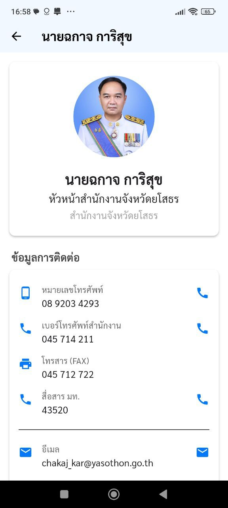
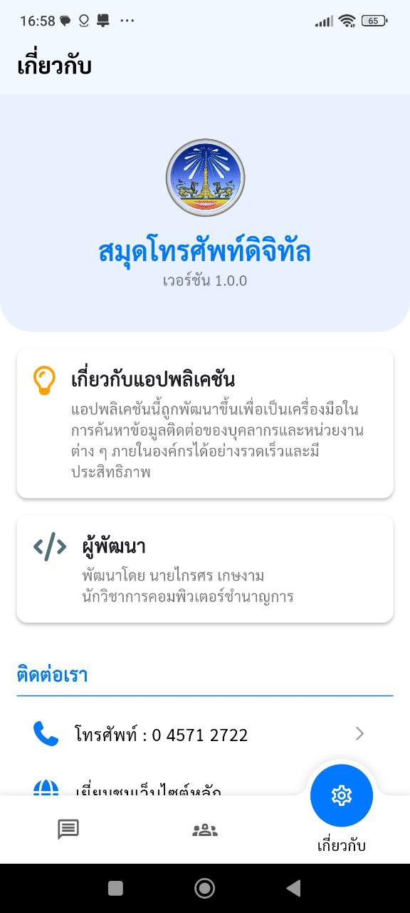

# 📞 Y-Phone — Yasothon Phonebook

Y-Phone (สมุดโทรศัพท์) แอปพลิเคชันนี้ถูกพัฒนาขึ้นเพื่อช่วยให้คุณค้นหาข้อมูลติดต่อของบุคลากรและหน่วยงานในสังกัดจังหวัดยโสธรได้อย่างรวดเร็วและมีประสิทธิภาพ:

* ค้นหารายชื่อและตำแหน่งได้ทันที
* ดูรายละเอียดการติดต่อ: เบอร์โทรศัพท์, เบอร์ภายใน, FAX และอีเมล
* กดโทรออกและส่งอีเมลได้โดยตรงจากแอปฯ
* รองรับการดึงข้อมูลจาก **REST API (Laravel)** เพื่อการอัปเดตข้อมูลที่สะดวก

[ทดลองใช้งาน https://play.google.com/store/apps/details?id=oneplan.yasothon.go.th.manage.contacts&hl=th](https://play.google.com/store/apps/details?id=oneplan.yasothon.go.th.manage.contacts&hl=th)
---

## ✨ ฟีเจอร์หลัก

* ค้นหาแบบ Real-time
* แสดงรายละเอียดติดต่อครบถ้วน (โทรศัพท์, ภายใน, FAX, E-mail)
* โทรออก/ส่งอีเมลจากในแอปได้ทันที
* กรองตามตำแหน่งหรือหน่วยงาน
* รองรับภาษาไทยเต็มรูปแบบ


---

## 🛠️ เทคโนโลยี

* Framework: **Flutter** (รองรับ Android / iOS)
* Backend / API: **Laravel** (RESTful API)
* HTTP client (ตัวอย่าง): `http` package หรือ `dio` ตามที่ใช้งาน
* Storage (ถ้ามี): SQLite / Shared Preferences
* Maps & Location: (ถ้าโครงการใช้) Google Maps Flutter

---

## 🖼️ ตัวอย่างหน้าจอแอป

(เพิ่มไฟล์ภาพตัวอย่างไว้ที่ `screenshots/` เช่น `home_screen.png`, `contact_list.png`, `contact_detail.png`)

|                             หน้าหลัก |                 รายละเอียด                |                  การติดต่อ                 |
| -----------------------------------: | :---------------------------------------: | :----------------------------------------: |
|  |  |  |

---

## 🚀 วิธีติดตั้งสำหรับนักพัฒนา

1. โคลนโปรเจกต์:

```bash
git clone https://github.com/strategy35000/yasothon_phonebook.git
cd yasothon_phonebook
```

2. ติดตั้ง dependencies:

```bash
flutter pub get
```

3. ตั้งค่าไฟล์ config (ตัวอย่าง):

* สร้าง `lib/config/api_config.dart` และกำหนด `baseUrl` ของ Laravel API:

```dart
const String kBaseUrl = 'https://api.your-domain.com/api/';
```

4. รันบนอุปกรณ์/emulator:

```bash
flutter run
```

---

## 🔌 ตัวอย่างโครงสร้าง API (Laravel)

**ตัวอย่าง endpoint (REST API)**

* `GET /api/contacts` — ดึงรายการผู้ติดต่อ (pagination)
* `GET /api/contacts/{id}` — ดึงข้อมูลรายละเอียดผู้ติดต่อ
* `GET /api/departments` — ดึงหน่วยงาน/แผนก
* (เพิ่มเติมตามการออกแบบ เช่น search: `GET /api/contacts?search=กุ้ง`)

**ตัวอย่าง response (contacts)**

```json
{
  "id": 1,
  "name": "นายสมชาย แสนดี",
  "position": "ผู้อำนวยการ",
  "phone": "045-123456",
  "extension": "123",
  "fax": "045-654321",
  "email": "somchai@yasothon.go.th",
  "department": "กองการศึกษา"
}
```

---

## 🔐 Keystore / Secrets (ข้อแนะนำ)

* **ห้าม**เก็บไฟล์ keystore (`*.jks`) หรือ secrets (API keys, tokens) ไว้ใน repository สาธารณะ
* ให้เพิ่ม entry ใน `.gitignore`:

```
android/app/upload-keystore.jks
*.jks
```

* สำหรับ CI/CD ให้ใช้ GitHub Secrets หรือ secret manager ของระบบ build
* หาก keystore เผลอหลุดสู่สาธารณะ ให้สร้าง keystore ใหม่ทันที

---

## 📜 เงื่อนไขการใช้งาน (Terms of Use) — ภาษาไทย (ฉบับละเอียด)

### 1. ขอบเขตการให้บริการ

Y-Phone เป็นแอปพลิเคชันสำหรับให้ข้อมูลติดต่อของบุคลากรและหน่วยงานภายใต้จังหวัดยโสธร ข้อมูลมาจากฐานข้อมูลที่ผู้ดูแลระบบของหน่วยงานป้อนและปรับปรุง ผู้ใช้งานสามารถค้นหาและติดต่อบุคคลหรือหน่วยงานตามวัตถุประสงค์ที่ระบุไว้

### 2. สิทธิ์การใช้งาน

* ผู้ใช้ได้รับสิทธิ์ใช้แอปเพื่อวัตถุประสงค์ส่วนบุคคลหรือเพื่อการปฏิบัติงานภายในหน่วยงานเท่านั้น
* ห้ามแก้ไข ดัดแปลง เผยแพร่ หรือจำหน่ายซอฟต์แวร์หรือข้อมูลสำหรับใช้เชิงพาณิชย์ โดยไม่ได้รับอนุญาตจากผู้พัฒนา

### 3. ความเป็นส่วนตัวและการเก็บข้อมูล

* แอปอาจร้องขอสิทธิ์ในการเข้าถึงฟังก์ชันของอุปกรณ์ เช่น ตำแหน่งหรือโทรศัพท์ เพื่อให้บริการฟีเจอร์ตามที่ประกาศ ผู้ใช้จะถูกขออนุญาตก่อนทุกครั้ง
* ข้อมูลส่วนบุคคลที่จัดเก็บจะถูกระบุและจัดการตามนโยบายความเป็นส่วนตัว (Privacy Policy) ที่แยกต่างหาก
* แอปจะไม่เผยแพร่ข้อมูลส่วนบุคคลต่อสาธารณะโดยไม่ได้รับความยินยอม ยกเว้นมีคำสั่งทางกฎหมาย

### 4. ความถูกต้องของข้อมูล

* ผู้พัฒนาไม่รับประกันความถูกต้อง ความครบถ้วน หรือความทันสมัยของข้อมูลที่แสดง อาจมีความคลาดเคลื่อนเนื่องจากข้อมูลจากแหล่งภายนอก (เช่นระบบฐานข้อมูลของหน่วยงาน)
* หากพบข้อมูลผิดพลาด กรุณาแจ้งผู้ดูแลระบบหรือผู้พัฒนาเพื่อแก้ไข

### 5. การจำกัดความรับผิด

* แอปถูกให้บริการในสภาพ "ตามสภาพ (as-is)" โดยผู้พัฒนาไม่ให้การรับประกันใด ๆ ทั้งโดยชัดแจ้งหรือโดยนัย
* ผู้พัฒนาไม่รับผิดชอบต่อความเสียหายโดยตรง ทางอ้อม พิเศษ หรือผลที่ตามมาจากการใช้แอป

### 6. การใช้งานที่ไม่อนุญาต

* ห้ามใช้แอปเพื่อการกระทำที่ผิดกฎหมาย ละเมิดสิทธิผู้อื่น หรือกระทำการโจมตีระบบคอมพิวเตอร์

### 7. การอัปเดตและการยุติการให้บริการ

* ผู้พัฒนอาจปล่อยอัปเดตเพื่อปรับปรุง ฟีเจอร์ และความปลอดภัยตามความจำเป็น
* ผู้พัฒนาสามารถยุติการให้บริการได้โดยไม่จำเป็นต้องแจ้งล่วงหน้า แต่จะแจ้งประกาศตามช่องทางที่เหมาะสม

### 8. การแก้ไขข้อพิพาท

* ข้อกำหนดนี้อยู่ภายใต้กฎหมายของราชอาณาจักรไทย และข้อพิพาทให้ตกอยู่ภายใต้เขตอำนาจศาลไทย

---

## 👨‍💻 ผู้พัฒนา / Contact

**นายไกรศร เกษงาม**

* ตำแหน่ง: นักวิชาการคอมพิวเตอร์
* อีเมล: [kraisorn_ket@yasothon.go.th](mailto:kraisorn_ket@yasothon.go.th)
* โทรศัพท์: 086-474-6990
* หน้าที่ความรับผิดชอบ: ออกแบบและพัฒนาแอป, จัดการ REST API (Laravel), แก้บั๊ก, สนับสนุนการติดตั้งและอัปเดตข้อมูล

**เวลาติดต่อที่แนะนำ:** จันทร์–ศุกร์ 09:00–16:30 (ยกเว้นวันหยุดราชการ)
ช่องทางแจ้งปัญหา: เปิด Issue บน GitHub หรือส่งอีเมลพร้อมรายละเอียด/ภาพประกอบ

---

## ใบอนุญาต (License)

โค้ดและเอกสารใน repository นี้สำหรับการศึกษาและใช้งานภายในหน่วยงานเป็นหลัก ห้ามนำไปใช้เชิงพาณิชย์โดยไม่ได้รับอนุญาตเป็นลายลักษณ์อักษรจากผู้พัฒนา
